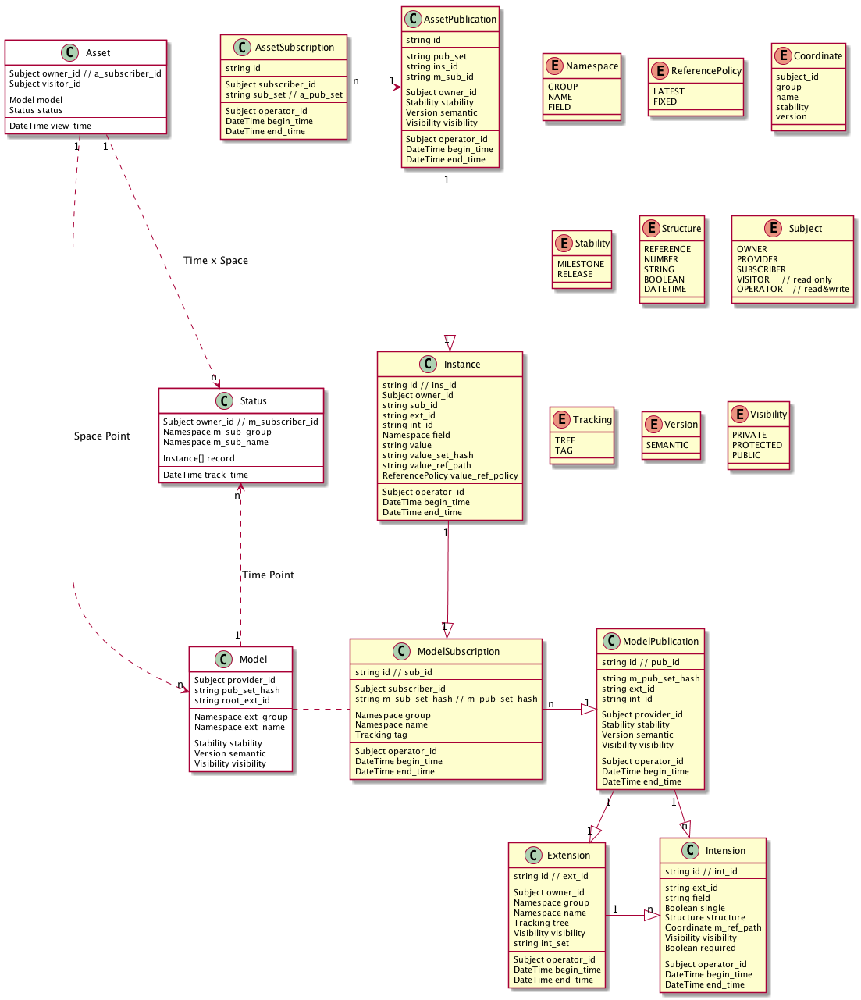

# KiiMate

Be the best **Mate** of **Knowledge Integration & Innovation**

## Concept Model

* Sharing and Managing your Knowledge like `Git` with RESTful API

## Basic Knowledge

### Related Concepts

* MetaData & MetaModel

* Model, Instance, Data, Entity, etc.

* Cloud Computing's Provider & Subscriber

### Technologies

* Spring Framework

* RESTful API

* Depends on [Summer](https://github.com/sinewang/summer)

## See Also

* [KiiStore](https://github.com/sinewang/kii-store)

* [Cross Reference Model Definition Language](crmdl.md)