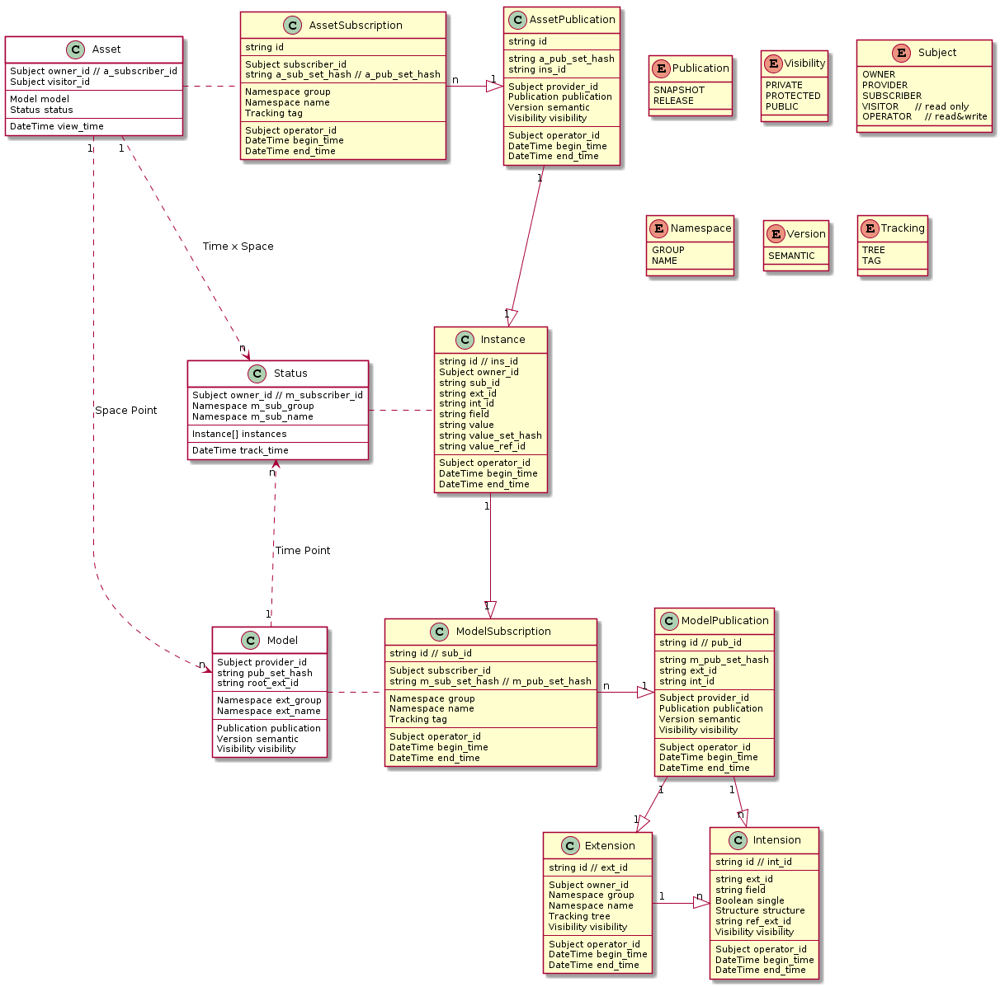

# KiiMate, be the best **Mate** of **Knowledge Integration & Innovation**

## Concept Model

* Sharing and Managing your Knowledge like `Git` with RESTful API

## Basic Knowledge

### Concepts

* MetaData & MetaModel

* Model & Entity

* Cloud Computing's Provider & Subscriber

### Technologies

* Spring Framework

* RESTful API

* Depends on [Summer](https://github.com/sinewang/summer)

## See Also

[Cross Reference Model Definition Language](crmdl.md)